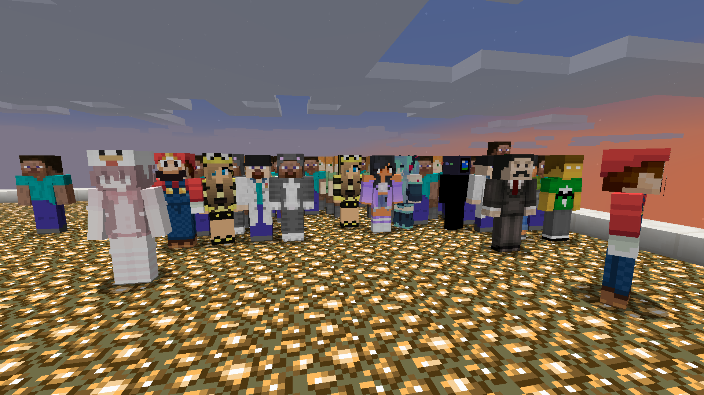

# Homunculus Mod

Homunculi are decorative entities that look just like players. They can use the skin of minecraft account, or a skin downloaded from a URL. They may be leashed and pulled around, and nametags may be applied to them to give them a player name.

A homunculus can be spawned like this:

	/summon homunculus:homunculus

A homunculus can be given a player skin like this:

	/summon homunculus:homunculus ~ ~ ~ {SkinOwner:{Name:jeb_}}
